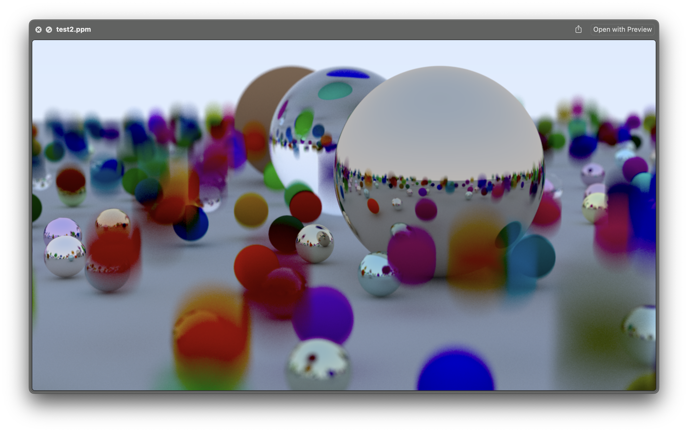

# Ray-Tracing-The-Next-Week-in-C

This project follows the popular tutorial series but translated to C. Pleae see [Raytracing the next week](https://raytracing.github.io/books/RayTracingTheNextWeek.html).  

> Most optimizations complicate the code without delivering much speedup.

This book is about understanding first and go with the simplest approach first.

The hardest topic of this book will be :
BVH (Bounding Volume Hierarchy) and Perlin Texture are concepts used in computer graphics, particularly in ray tracing.

- BVH (Bounding Volume Hierarchy): This is a tree structure on a set of geometric objects. All geometric objects are wrapped in bounding volumes that form the leaf nodes of the tree. These nodes are then grouped as small sets and enclosed within larger bounding volumes. These, in turn, are also grouped and enclosed within other larger bounding volumes in a recursive fashion, eventually resulting in a tree structure with a single bounding volume at the top of the tree. BVH is used to support efficient geometric operations like ray tracing.

- Perlin Texture: Perlin Texture is a type of gradient noise developed by Ken Perlin. It's a procedural texture primitive, a type of function that generates textures using mathematical formulas. It's widely used in computer graphics to increase the realism of rendered images, particularly in the context of surfaces where a high level of detail is required. It's often used to create procedural patterns like clouds, marble, water, and terrain.

## Some definitions
### A Cornell Box
A Cornell Box is a test aimed at physically based rendering and global illumination algorithms. It was first introduced by Cornell University's Program of Computer Graphics.

The box is a simple room-like model containing two cubes. The walls of the room are colored: left wall is red, right wall is green, and the other walls (including the floor and ceiling) are white. The two cubes in the room are white.

The simplicity of the scene and the known colors of the objects in the scene make it an ideal candidate for testing rendering algorithms. The scene tests how well the algorithms handle diffuse inter-reflection, which is the effect of light bouncing off walls and other objects in the scene, and indirect illumination, which is light that arrives at a surface after reflecting off other surfaces, not directly from a light source.

### Random (Monte Carlo) Ray Tracing 
This what we have been doing until now.  
The Monte Carlo Ray Tracing is a method used in computer graphics to generate images by tracing the path of light through pixels in an image plane and simulating the effects of its encounters with virtual objects. 

The term "Monte Carlo" comes from the use of randomness in the algorithm. Instead of tracing every possible light path (which would be computationally infeasible), Monte Carlo Ray Tracing traces a random subset of these paths. For each pixel, many rays are sent out. Each ray represents a possible path that light could take from the camera to the scene. 

When a ray hits an object, instead of calculating the exact light reflection, the algorithm randomly decides the new direction of the ray, based on the properties of the material. This process is repeated many times per pixel, and the colors of the paths are averaged to get the final color of the pixel.

## Motion Blur.
When the camera or the object moves while the shutter is open, the resulting image will have a blur effect. 
We will add a time property to the ray struct.

Imagine having a camera. How long is the shutter open will determine if the image will have motion blur. If we have the shutter open for a 20th of a second then if a sphere is moving we will have rays hitting the sphere at different position between center 1 and center 2. I will make the position of the sphere a function of the shutter time. For now we will keep it simple. Adding a time parameter to the ray struct and in the camera get_ray function.

We will make some spheres, the matt ones, move vertically with a random speed.

The generated picture will be looking like this:

## links
- [Raytracing in one weekend](https://raytracing.github.io/books/RayTracingInOneWeekend.html)  
- [Raytracing the next week](https://raytracing.github.io/books/RayTracingTheNextWeek.html)  
- [Raytracing the rest of your life](https://raytracing.github.io/books/RayTracingTheRestOfYourLife.html)  
- stb_image.h, a header-only image library available on GitHub at https://github.com/nothings/stb.
- [https://gabrielgambetta.com/computer-graphics-from-scratch/](https://gabrielgambetta.com/computer-graphics-from-scratch/)  
- A raytracer on the back of a business card. [https://fabiensanglard.net/rayTracing_back_of_business_card/](https://fabiensanglard.net/rayTracing_back_of_business_card/)

## Here are a few really good resources by [Fabien Sanglard](https://fabiensanglard.net/about/index.html):

- scratchapixel.com : Great raytracer lessons written by professionals that have worked on Toy Story, Avatar, Lord of the Rings, Harry Potter, Pirates of the Caribbean and many other movies.  
- An Introduction to Ray Tracing : An old book but a Classic.  
- Physically Based Rendering : Heavy on maths but really good and well explained.  

