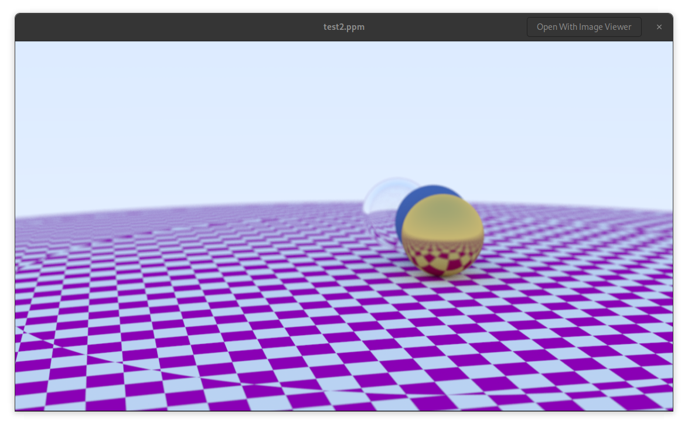
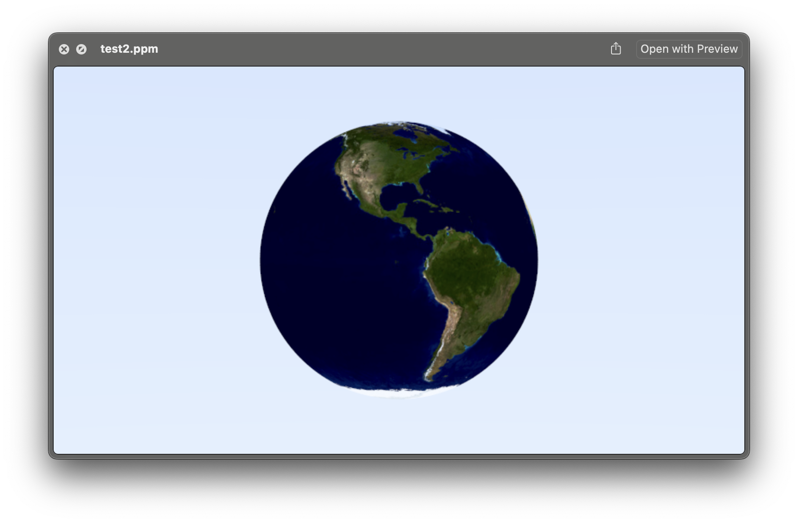
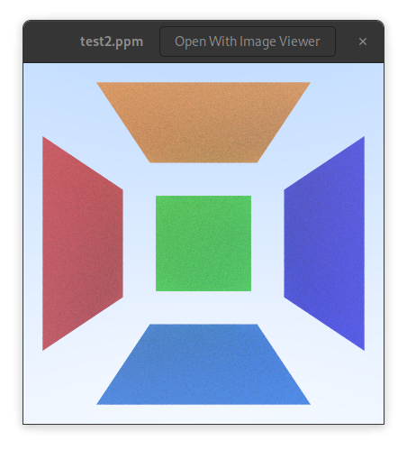
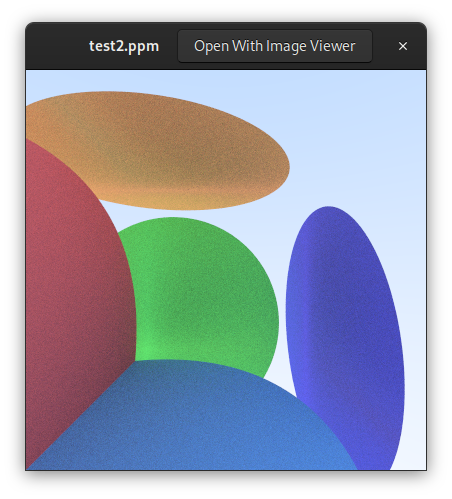
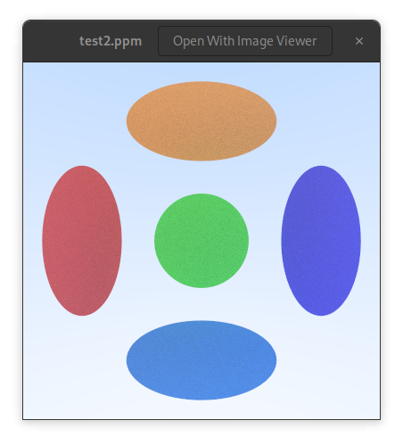

# Ray-Tracing-The-Next-Week-in-C

This project follows the popular tutorial series but translated to C. Pleae see [Raytracing the next week](https://raytracing.github.io/books/RayTracingTheNextWeek.html).  

> Most optimizations complicate the code without delivering much speedup.

This book is about understanding first and go with the simplest approach first.

The hardest topic of this book will be :
BVH (Bounding Volume Hierarchy) and Perlin Texture are concepts used in computer graphics, particularly in ray tracing.

- BVH (Bounding Volume Hierarchy): This is a tree structure on a set of geometric objects. All geometric objects are wrapped in bounding volumes that form the leaf nodes of the tree. These nodes are then grouped as small sets and enclosed within larger bounding volumes. These, in turn, are also grouped and enclosed within other larger bounding volumes in a recursive fashion, eventually resulting in a tree structure with a single bounding volume at the top of the tree. BVH is used to support efficient geometric operations like ray tracing.

- Perlin Texture: Perlin Texture is a type of gradient noise developed by Ken Perlin. It's a procedural texture primitive, a type of function that generates textures using mathematical formulas. It's widely used in computer graphics to increase the realism of rendered images, particularly in the context of surfaces where a high level of detail is required. It's often used to create procedural patterns like clouds, marble, water, and terrain.

## Some definitions
### A Cornell Box
A Cornell Box is a test aimed at physically based rendering and global illumination algorithms. It was first introduced by Cornell University's Program of Computer Graphics.

The box is a simple room-like model containing two cubes. The walls of the room are colored: left wall is red, right wall is green, and the other walls (including the floor and ceiling) are white. The two cubes in the room are white.

The simplicity of the scene and the known colors of the objects in the scene make it an ideal candidate for testing rendering algorithms. The scene tests how well the algorithms handle diffuse inter-reflection, which is the effect of light bouncing off walls and other objects in the scene, and indirect illumination, which is light that arrives at a surface after reflecting off other surfaces, not directly from a light source.

### Random (Monte Carlo) Ray Tracing 
This what we have been doing until now.  
The Monte Carlo Ray Tracing is a method used in computer graphics to generate images by tracing the path of light through pixels in an image plane and simulating the effects of its encounters with virtual objects. 

The term "Monte Carlo" comes from the use of randomness in the algorithm. Instead of tracing every possible light path (which would be computationally infeasible), Monte Carlo Ray Tracing traces a random subset of these paths. For each pixel, many rays are sent out. Each ray represents a possible path that light could take from the camera to the scene. 

When a ray hits an object, instead of calculating the exact light reflection, the algorithm randomly decides the new direction of the ray, based on the properties of the material. This process is repeated many times per pixel, and the colors of the paths are averaged to get the final color of the pixel.

## Motion Blur.
When the camera or the object moves while the shutter is open, the resulting image will have a blur effect. 
We will add a time property to the ray struct.

Imagine having a camera. How long is the shutter open will determine if the image will have motion blur. If we have the shutter open for a 20th of a second then if a sphere is moving we will have rays hitting the sphere at different position between center 1 and center 2. I will make the position of the sphere a function of the shutter time. For now we will keep it simple. Adding a time parameter to the ray struct and in the camera get_ray function.

We will make some spheres, the matt ones, move vertically with a random speed.

The generated picture will be looking like this:

<div style="text-align: center;">

</div>

# BVH (Bounding Volume Hierarchy)
The BVH is a tree structure on a set of geometric objects.  
Ray-object intersection is the main time-bottleneck in a ray tracer, and the run time is linear with the number of objects.  The idea is that we have an array of object where we look one by one for a hit, so it is O(n) complexity. We should be aboe to make it O(log(n)) complexity if we group the objects in a tree structure in bounding volumes.
The bounding volumes are approximated because if we have a hit we will look for the intersection, but if not we will just move on.  
This is a great optimisation.  I will skip for now in this project and look at the lighting first.

# Texture mapping
> Texture mapping in computer graphics is the process of applying a material effect to an object in the scene. The “texture” part is the effect, and the “mapping” part is in the mathematical sense of mapping one space onto another. This effect could be any material property: color, shininess, bump geometry (called Bump Mapping), or even material existence (to create cut-out regions of the surface).  The most common type of texture mapping maps an image onto the surface of an object, defining the color at each point on the object’s surface. In practice, we implement the process in reverse: given some point on the object, we’ll look up the color defined by the texture map. 

For the texture we will do something similar to the materials. Since we dont have an abstract class we will use a base pointer to the texture object and create specialized texture functions. `t_texture` is our `abstract class` and `t_solid_color` is our `concrete class`.
```c
typedef struct s_texture
{
	t_color (*value)(const void *self, double u, double v, const t_point3 *p);
}               t_texture;

typedef struct s_solid_color
{
	t_texture base;
	t_color color_albedo;
	
}               t_solid_color;

void solid_color_init(t_solid_color *solid_color_texture, t_color albedo);
t_color solid_color_value(const void *self, double u, double v, const t_point3 *p);

```
The `value` function is a pointer to a function that will return the color of the texture at the point `p` with the coordinates `u` and `v`.

### first try
To explore spatial textures, we'll implement a spatial checker_texture. For now given these three integer results (⌊x⌋,⌊y⌋,⌊z⌋), we take their sum and compute the result modulo two, which gives us either 0 or 1. Zero maps to the even color, and one to the odd color. Finally, we add a scaling factor to the texture, to allow us to control the size of the checker pattern in the scene.  
It is not perfect because we check only if the point in 3d is a 0 or a one, not the surface..
We will use the `checker_texture` struct and the `checker_texture_init` function to initialize it.  For a start then the lambertian material will have a texture instead of a color.  
```c
typedef struct s_texture
{
	t_color (*value)(const void *self, double u, double v, const t_point3 *p);
}               t_texture;

typedef struct s_solid_color
{
	t_texture base;
	t_color color_albedo;
}               t_solid_color;

// the albedo is now part of the texture
void	solid_color_init(t_solid_color *solid_color_texture, t_color albedo)
{
	solid_color_texture->base.value = solid_color_value;
	solid_color_texture->color_albedo = albedo;
}	

// we dont care about the surface coordinates for now
t_color solid_color_value(const void *self, double u, double v, const t_point3 *p)
{
	(void)u;
	(void)v;
	(void)p;
	t_solid_color *solid_color = (t_solid_color *)self;
	return (solid_color->color_albedo);
}

void lambertian_init_tex(t_lambertian *lambertian_material, t_texture *tex) 
{
    lambertian_material->base.scatter = lambertian_scatter; // Assign the scatter function
    lambertian_material->albedo = color(0,0,0); // Set the albedo to null
	lambertian_material->texture = tex;
}
```
So the value fuction will return a color based on the texture. And all is like before. But we eill implement a new texture, the checker_texture. It will have a scale, and two colors, one for the even and one for the odd.  Really in the book it assignes textures to the even and odd but we will use the solid_color for now.  
```c

typedef struct 		s_checker_texture
{
	t_texture 		base;
	double    		inv_scale;
	t_solid_color 	*even;
	t_solid_color 	*odd;
}               	t_checker_texture;
/*
** Checker texture
* colors for the checkerboard ex
* even_color = color(0.5, 0.0, 0.5); // Purple
* odd_color = color(1.0, 1.0, 1.0); // White
*/
void	checker_texture_init(t_checker_texture *checker_texture, double scale, t_solid_color *even, t_solid_color *odd)
{
	printf("checker_texture_init done ================ ");
	checker_texture->base.value = checker_texture_value;
	checker_texture->inv_scale = 1.0 / scale;
	checker_texture->even = even;
	checker_texture->odd = odd;
}

t_color checker_texture_value(const void *self, double u, double v, const t_point3 *p)
{
	(void)u;
	(void)v;
	int xint = (int)floor(p->x * ((t_checker_texture*)self)->inv_scale);	
	int yint = (int)floor(p->y * ((t_checker_texture*)self)->inv_scale);
	int zint = (int)floor(p->z * ((t_checker_texture*)self)->inv_scale);

	bool is_even = (xint + yint + zint) % 2 == 0;
	if (is_even)
		return (((t_checker_texture*)self)->even->color_albedo);
	else
		return (((t_checker_texture*)self)->odd->color_albedo);
}

```
The `checker_texture_value` function will return the color of the texture at the point `p`.
This are some of the results we can get.

<div style="text-align: center;">

</div>
<div style="text-align: center;">


</div>

### Second try
It is looking good but we can see some imperfection or glitches. Since checker_texture is a spatial texture, we're really looking at the surface of the sphere cutting through the three-dimensional checker space.

Now it's time to make use of the 𝑢,𝑣 texture coordinates.  

### get the 𝑢,𝑣 coordinates of a sphere.
(see the book for an indepth math explanation)

My sphere will get a new function to get the uv coordinates for each point on the surface.  
With these I can get the value of the texture at the point.  The texture will be usually an image file. 

```c
void	get_sphere_uv(const t_point3* p, double* u, double* v)
{
    double theta;
    double phi;

	theta = acos(-p->y);
	phi = atan2(-p->z, p->x) + M_PI;
    *u = phi / (2 * M_PI);
    *v = theta / M_PI;
}
```
We now need to update the sphere hit function to get the uv coordinates.  
```c

```
From the hitpoint 𝐏, we compute the surface coordinates (𝑢,𝑣). We then use these to index into our procedural solid texture (like marble). We can also read in an image and use the 2D (𝑢,𝑣) texture coordinate to index into the image. We use texture coordinates instead of image pixel coordinates. These are just some form of fractional position in the image.  

We need an image loader. We will use the stb_image.h library.  It is a header library because the whole library is basically included in the header file.  It has to be included once only even using guards. I included it in my `rtw_stb_image.c` file otherwise I would have compilation errors.
- copy the `stb_image.h` file in the include folder.  
- create a new file `rtw_stb_image.c` and include the `stb_image.h` file.  
- add the header file `rtw_stb_image` file in the include but do not include the `stb_image.h` again.
In the `rtw_stb_image.c` you need this at the top
```c
// need to include only oncd and not in the header file
#define STB_IMAGE_IMPLEMENTATION
#include "external/stb_image.h"
#define STB_IMAGE_WRITE_IMPLEMENTATION
#include "external/stb_image_write.h"
#include "rtw_stb_image.h"

```
I will take the code from the book and adapt it to C.  It will be a header file called `rtw_stb_image.h`.
And I create a struct to handle the image being converted to bytes...
```c
typedef struct		s_rtw_image 
{
    int				bytes_per_pixel;
    float			*fdata; // Linear floating point pixel data
	unsigned char	*bdata; // Linear 8-bit pixel data
    int				image_width; // Loaded image width
    int				image_height; // Loaded image height
    int				bytes_per_scanline;
} 					t_rtw_image;
```
The `t_rtw_image` struct will hold the image data.  The `fdata` will hold the floating point pixel data and the `bdata` will hold the 8-bit pixel data.  The `bytes_per_pixel` will hold the number of bytes per pixel.  The `image_width` and `image_height` will hold the width and height of the image.  The `bytes_per_scanline` will hold the number of bytes per scanline.

As usual I create the struct instance on the stack and passit to the initializer together with the relative path to my image. in this case it is a sphere and it will get the earth image.  
```c
void init_rtw_image(t_rtw_image *img, char *filename) 
{
    img->bytes_per_pixel = 3;
    img->fdata = NULL;
    img->bdata = NULL;
    img->image_width = 0;
    img->image_height = 0;
    img->bytes_per_scanline = 0;
	// rtw_image/earthmap.jpg
	printf("filename = %s\n", filename);
	if (load(img, filename) == 0) {
		fprintf(stderr, "Failed to load image %s\n", filename);
		exit(1);
	}
	printf("Image loaded\n");
}
```
We will have other functions to handle the conversion...
but for my sphere I will have a function applying the maths which will convert the value of the u,v coordinates to the pixel coordinates in the image which I loaded.  
```c
t_color img_texture_value(const void *self, double u, double v, const t_point3 *p)
{
	// unused!
	(void)p;
	// If we have no texture data, then return solid cyan as a debugging aid.
	t_img_texture *image;
	
	image = (t_img_texture *)self;
	if (height(image->img) <= 0) 
		return color(0, 1, 1);
	
	// Clamp input texture coordinates to [0,1] x [1,0]
	u = clamp(interval(0, 1), u);
	v = 1.0 - clamp(interval(0, 1), v); // Flip V to image coordinates
	// printf("u = %f,	 v = %f\n", u, v);
	int i = (int)(u * width(image->img));
	int j = (int)(v * height(image->img));
	// pixel is a pointer to the first byte of the RGB triplet
	unsigned char *pixel = pixel_data(image->img, i, j);
	// Scale color values to [0,1]
	double color_scale = 1.0 / 255.0;
	double r = *pixel * color_scale;
	double g = *(++pixel) * color_scale;
	double b = *(++pixel) * color_scale;
	// printf("r = %f, g = %f, b = %f\n", r, g, b);
	return color(r, g, b);
}
```
And it will return a color.
This is how the sphere looks like with the earth image as a texture.
<div style="text-align: center;">

</div>

## Perlin Noise
I skip this for now...


## Quadrilaterals
We'll name our new primitive a quad.  
There are three geometric entities to define a quad:

- Q, the starting corner.
- u, a vector representing the first side. Q+u gives one of the corners adjacent to Q.
- v, a vector representing the second side. Q+v gives the other corner adjacent to Q.

These values are three-dimensional, even though a quad itself is a two-dimensional object

Just as for spheres, we need to determine whether a given ray intersects the primitive, and if so, the various properties of that intersection (hit point, normal, texture coordinates and so forth).

Ray-quad intersection will be determined in three steps:

- finding the plane that contains that quad,
- solving for the intersection of a ray and the quad-containing plane,
- determining if the hit point lies inside the quad.

I refer to the book for the mathemathics, but like for the sphere there is an implicit formula for a plane:
$$
Ax+By+Cz+D=0
$$
Here's an intuitive way to think of this formula: given the plane perpendicular to the normal vector $n=(A,B,C)$, and the position vector $v=(x,y,z)$ (that is, the vector from the origin to any point on the plane), then we can use the dot product to solve for D:
$$
n⋅v=D
$$
for any position on the plane. This is an equivalent formulation of the $Ax+By+Cz=D$ formula given above, only now in terms of vectors.  
Now to find the intersection with some ray $R(t)=P+td$  
Plugging in the ray equation, we get
$$
n⋅(P+td)=D
$$
Solving for t:
$$
n⋅P+n⋅td=D  
$$
$$
n⋅P+t(n⋅d)=D  
$$
This gives us t.
$$
t = \frac{D - n \cdot P}{n \cdot d}
$$

## finding the plane for the quad

We have quadrilateral parameters Q, u, and v, and want the corresponding equation of the plane containing the quad defined by these three values. 
To get this, we just use the cross product of the two side vectors u and v:  
$$
n=unit_vector(u×v)
$$

So we add the double D and the normal to our quad struct.

This is the updated struct and the hit function.
```c
typedef struct s_quad
{
	t_hittable  base;
	t_point3	q;
	t_vec3		u;
	t_vec3		v;
	t_material	*mat;
	double		d;
	t_vec3		normal;
	t_vec3		w;
}				t_quad;

t_quad quad(t_point3 q, t_vec3 u, t_vec3 v, t_material *mat)
{
	t_quad qd;

	qd.base.hit = hit_quad;
	qd.q = q;
	qd.u = u;
	qd.v = v;
	qd.mat = mat;
	t_vec3 n = cross(u, v);
    qd.normal = unit_vector(n);
    qd.d = dot(qd.normal, q);
	qd.w = vec3divscalar(n, dot(n, n));
	
	return (qd);
}

bool hit_quad(const void* self, const t_ray *r, t_interval ray_t,  t_hit_record *rec)
{
	// printf("hit_quad ----------------------********\n");
	const t_quad *qd = (t_quad *)self;
	double denom = dot(qd->normal, r->dir);
	// no hit if ray is parallel to the quad
	if (fabs(denom) < 1e-8)
		return false;

	// Return false if the hit point parameter t is outside the ray interval.
	double t = (qd->d - dot(qd->normal, r->orig)) / denom;
	if (!contains(&ray_t, t))
		return false;
	
	// Determine the hit point lies within the planar shape using its plane coordinates.
	// t_point3	point_at(const t_ray *ray, double t)
	t_point3 intersection = point_at(r, t);
	t_vec3 planar_hitpt_vector = vec3substr(intersection, qd->q);
	double alpha = dot(qd->w, cross(planar_hitpt_vector, qd->v));
	double beta = dot(qd->w, cross(qd->u, planar_hitpt_vector));

	if (!is_interior(alpha, beta, rec))
		return false;

	// Ray hits the 2D shape; set the rest of the hit record and return true.
	rec->t = t;
	rec->p = intersection;
	rec->mat = qd->mat;
	set_face_normal(rec, r, qd->normal);

	return true;
}

```

and the result is this:
<div style="text-align: center;">

</div>

## all 2d shapes are definite by the `interior` function
```c

```

So as in the book I managed to change the function for a disk.... and created a disk struct etc.  
The init for a disk is a duplicate of the init for a quad, because I first create the plane on which the disk is and then I create the disk.  

So this is what I got. 


<div style="text-align: center;">

</div> 

Of course I need to tweak the init function to get the disk created around a center and not a corner.  

<div style="text-align: center;">

</div>

The disks above are created in the same way way as the parallelograms. They are then drawn inside them.

This time I pass the u and v vectors to the disk interior function because the vectors are not orthogonal.
```c
bool is_interior_disk(double a, double b, t_hit_record *rec, t_vec3 u, t_vec3 v) 
{
    // The center of the disk in plane coordinates is (0.5, 0.5)
    double u_squared = (a - 0.5) * (a - 0.5);
    double v_squared = (b - 0.5) * (b - 0.5);
    double uv = (a - 0.5) * (b - 0.5);

    // The radius of the disk is 0.5 in plane coordinates
    double radius_squared = 0.25;

    // The angle between the vectors u and v
    double cos_theta = dot(u, v) / (length(u) * length(v));

    // The distance from the point to the center of the disk in the plane coordinates of the parallelogram
    double distance_squared = u_squared + v_squared - 2 * uv * cos_theta;

    if (distance_squared > radius_squared)
        return false;

    rec->u = a;
    rec->v = b;
    return true;
}
```


## links
- [Raytracing in one weekend](https://raytracing.github.io/books/RayTracingInOneWeekend.html)  
- [Raytracing the next week](https://raytracing.github.io/books/RayTracingTheNextWeek.html)  
- [Raytracing the rest of your life](https://raytracing.github.io/books/RayTracingTheRestOfYourLife.html)  
- stb_image.h, a header-only image library available on GitHub at https://github.com/nothings/stb.
- [https://gabrielgambetta.com/computer-graphics-from-scratch/](https://gabrielgambetta.com/computer-graphics-from-scratch/)  
- A raytracer on the back of a business card. [https://fabiensanglard.net/rayTracing_back_of_business_card/](https://fabiensanglard.net/rayTracing_back_of_business_card/)

## Here are a few really good resources by [Fabien Sanglard](https://fabiensanglard.net/about/index.html):

- scratchapixel.com : Great raytracer lessons written by professionals that have worked on Toy Story, Avatar, Lord of the Rings, Harry Potter, Pirates of the Caribbean and many other movies.  
- An Introduction to Ray Tracing : An old book but a Classic.  
- Physically Based Rendering : Heavy on maths but really good and well explained.

- A great youtube series https://www.youtube.com/playlist?list=PLlrATfBNZ98edc5GshdBtREv5asFW3yXl

